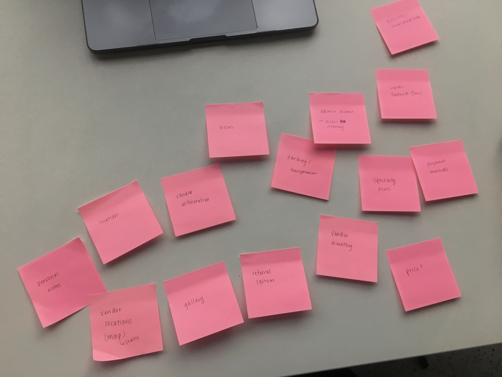
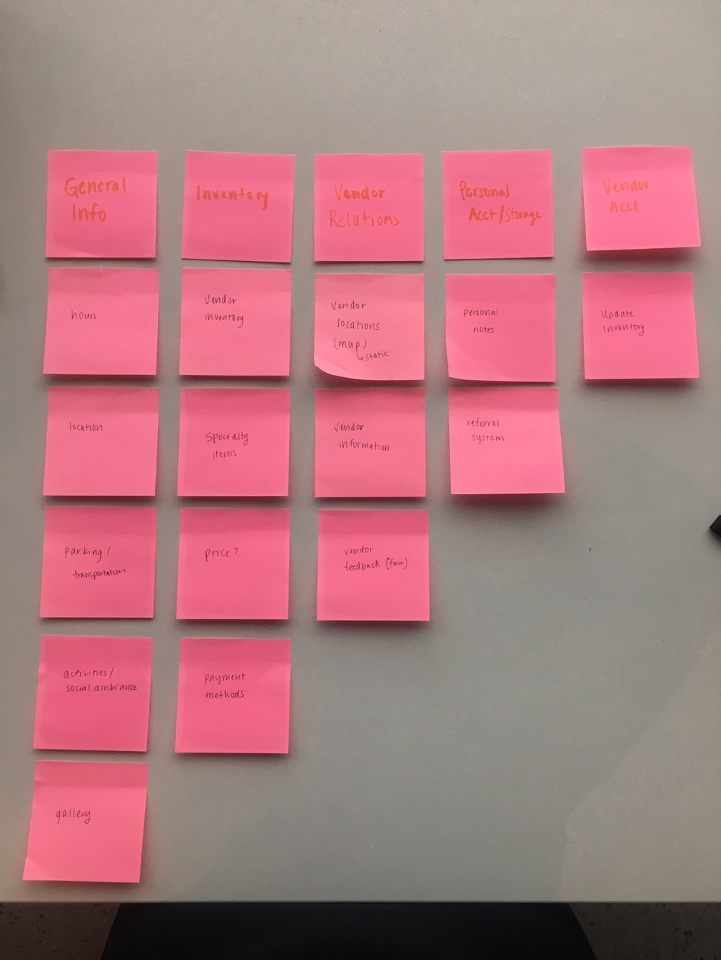

# Brainstorm & Features

## Site content:

Organizing content:

The first task was to determine and organize the content for the site. In order to address our user's main issues, we decided to focus on an inventory category and vendor category. The inventory category would somehow organize the existing inventory at the market and would give the vendors a space to showcase their specialty items. It would allow the user to filter and search through these items and give them information on certain points that they found important such as price and payment options for vendors as well. As for the vendors page, the vendor contact information would be listed and made visible for the user to encourage relations between the user and vendor. The other content we thought would be important for the user included a general information section so the user would know when/where the market was as well as address some of the parking complaints; a notes feature that allows the user to keep track of certain vendors or items that they wanted to remember (e.g. if they're walking through the market and want to take note of what to buy later); and a vendor account so that vendors can update their own inventory.

## Final cardsort: 

Based on the categories of content described above, we card sorted the content into: general info, inventory, vendor info, notes, and vendor account. This type of content organization allows the user to accomplish distinct tasks in each category so that each page has its own purpose.

## Brainstorming Design and Functionality

### App Purpose
The purpose of the app was determined to be a reference app over a planning app; i.e. the user would primarily use this app during their visit to the market. This is because users repeated certain issues about having to remember certain things about the market while they were at the market. For example, some regulars at the market already have knowledge about which product will sell out by what time, so if a user could make an immediate note about this at the market, it would help them remember it for future reference. Another use case is if a user wanders around the market to look at items but only wants to buy the items in one round at the end of the visit, the app would allow them to remember certain vendors or items that they walked past earlier. These examples demand an immediacy of action so that the user does not need to rely on their memory. Therefore, because we set the app's purpose to be a reference app, all of its functionalities were meant to be shorter tasks that could be accomplished within a few seconds. The amount of clicks was something we especially took into consideration if the user was looking for a piece of information or looking to accomplish something on the app.

### Navigation:
The options we had were: should we lay the navigation out on the top of the page, in a hamburger tab that opened a side navigation, or as a bar along the bottom of the app? All three options seemed to be feasible for a mobile app, but the hamburger tab and the bottom navigation were more widely used in a lot of the mobile sites we frequented. The hamburger tab would allow for more pages on the site, whereas the bottom navigation would save the user one click if they wanted to navigate away. Ultimately, the bottom navigation was the one we picked because our site wouldn't have that many pages and it would allow us to implement a hamburger tab on the inventory page to separate the inventory into categories. Our concern with this choice, however, was that if the user is using the app on a mobile browser, the browser itself would already have a row on the bottom for navigation/functionality so it may be confusing to stack the two rows. We were looking into how to deploy the PWA so that it wouldn't live on the browser. 

### General information:
Our concern with the general information page was that there may be too much information to display and the user may get lost looking for a specific piece of information. We thought about splitting it up into two pages (home and about), but determined that this detracted from the main purpose of our app. We also looked into the solution space and how Ithaca's existing farmers market site organized their information. Our next question concerned the gallery: should this be related to the community events we're trying to advertise? Or should it just be there to give new patrons a sense of what the market is like? We decided to add a couple of pictures around the site but ultimately didn't give it its own space because it didn't feel necessary for the purpose of our site. For the design of our site, we wanted this page especially to be a display of important information. The user will be able to see the hours, location, and special events of the market immediately, then display other information like parking and activities (e.g. boat tours) farther down the page.

### Displaying inventory:
Figuring out how to display our inventory was one of our biggest challenges in functional design. We knew that we wanted to have an inventory but were unsure of what information it would convey, how it would be sorted, if users would be able to search, etc,... 

We didn't know if we wanted to display items as unique inventory items (e.g. the carrot from this farm is different from the carrot at that farm) or as categories of items, or if we wanted to sort the inventory by vendor. We decided to display the product as a generic item (e.g. "carrot"), then list all of the vendors that sold the product in view when pressing on the product. Specialty items would get their own category. The users would also get to see the items by category (e.g. fruits, vegetables) to decrease the volume of information they see all at once. We debated having a search bar but ultimately decided that it would be useful to give the user more control, especially if they knew what they were looking for.

For the layout, we decided between organizing the page as a table or as a shopping site with individual items in boxes. Similar to the other decisions made for our design, we decided against the table because the user would have difficulty in reading the text on a mobile screen. Therefore, we used online shopping sites as inspiration and decided to display the product image and name, then allow the user to press the product for more information (the vendors, cash/credit, seasonal?).

Finally, as for design, we knew we wanted more information to pop out when the user clicked on an item and had originally decided on a modal but realized that it may be more annoying on a phone screen. We're currently looking for alternatives based on what existing phone apps do to display extra information.

### Personal account page:
The personal account page also caused a lot of debate in the group because we knew we wanted to make the experience personal for the user but were unsure of how to do so. We debated letting the user favorite different inventory items or vendors, or just being able to write notes. We weren't sure how this notes feature would differ from the notes app on the phone. Originally, the idea was to allow the user to select a category for the note (vendor, food, etc) then make a general note about it but we wanted to make this feature special for the farmers market. Therefore, we came up with the idea of selecting favorite items/vendors and adding them to a list, but it seemed to complicate our display. Finally, we came back to the purpose of our app which is that the user would want to make a quick note of something that they see when they're at the market. The user should be able to make a note of a vendor from the notes page and we'd integrate the vendors page with the notes page. Therefore, if a user saw an item they were interested in at a particular vendor, they can jot down the location of the vendor and what it is they want to buy, then come back for it. 

### Gamification:
We wanted to make the gamification aspect an extension of the user accounts. Our first idea that related to gamification was incorporating a referral system. We learned from the vendors that word of mouth was the best form of communication to spread word of their business, so to facilitate this, we wanted to encourage the users to refer certain vendors or products to their friends. In order to gamify this, we brainstormed implementing levels, points, and a leaderboard. Since solely referring someone didn't feel like enough to qualify as gamification, we decided to implement a three-part system where the user would have to visit a vendor, purchase a product, and refer them in order to receive points. These points would allow them to level up and would unlock certain privileges such as discounts.

### Vendor account:
Since the vendors are not our target audience, we questioned where to put the login and how visible we wanted this feature to be. Originally, there would just be an update button on the inventory page, but since we didn't want the users to be exposed to this side of the app as well, we decided that the vendor account would only be accessible through a link not included in the navigation. This would direct the user to log in, then would take them to a form pre-populated with their previous responses with their name, inventory, payment type, and location. The vendor would be able to update this information. We also wondered if we should allow the vendors to upload their own images for their produce but decided in order to keep with our inventory layout, we'd use stock images instead. 