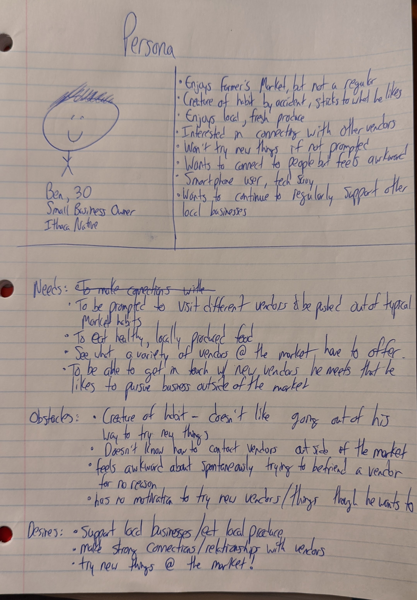

# Persona

If the text on the picture is hard to read, there is text below the picture explaining our persona.

Our persona's name is Ben.  He is a Small Business Owner (not a food related business) who lives in Ithaca and is 30 years old. 

Details about Ben:

- He enjoys the Farmer's Market but is not quite a regular

- He enjoys the wonderful things Ithaca provides.  Applefest, Farmer's Market, beautiful nature, etc.

- he likes to eat fresh produce grown locally.  Thinks it tastes better, is healthier

- It is important that he supports local businesses, as he owns a local business as well.

- He wants to connect with other vendors

- Struggles to try new things if not prompted

- Wants to connect with more people but sometimes feels awkward

- Comfortable using a smartphone.

Ben's needs:

- Be prompted to visit different vendors
- eat healthy, high quality foods
- know what kind of variety of vendors the farm has to offer he can purchase from which vendors.
- to be able to make connections with vendors at the market and get in touch with them outside of the market.

Ben's obstacles:
- doesn't know how to contact vendors @ the market
- feels awkward about randomly asking a vendor what they have
- creature of habit, struggles to go out of way to try new things

Ben's desires:
- eat locally produced food
- build relationships with vendors
- try new things at the market

