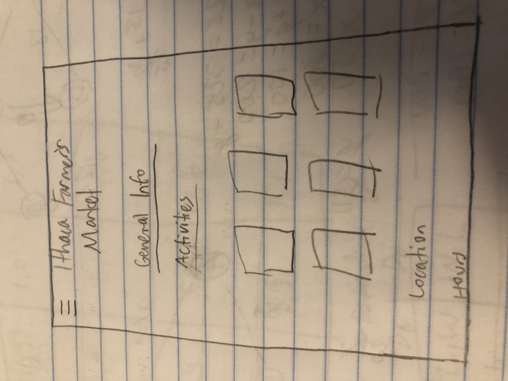

Homepage: 

For the home page, we wanted to make sure key information was displayed at the very top so that the user would know where the information they are looking for is, and won't have to scroll around for it. Since we don't have an "about" page in our navigation, we wanted to make sure it was clear to the user that any necessary about information would be displayed on the home page, and make this evident to the user as soon as they entered the page. That is why we included the location and hours of the Ithaca Farmer's Market at the very top, since that is information users may be looking for immediately logging onto the app. Underneath that, we give an "About" blurb on what the farmer's market is, and then a section on parking and transportation to help users better plan their trip to the market.