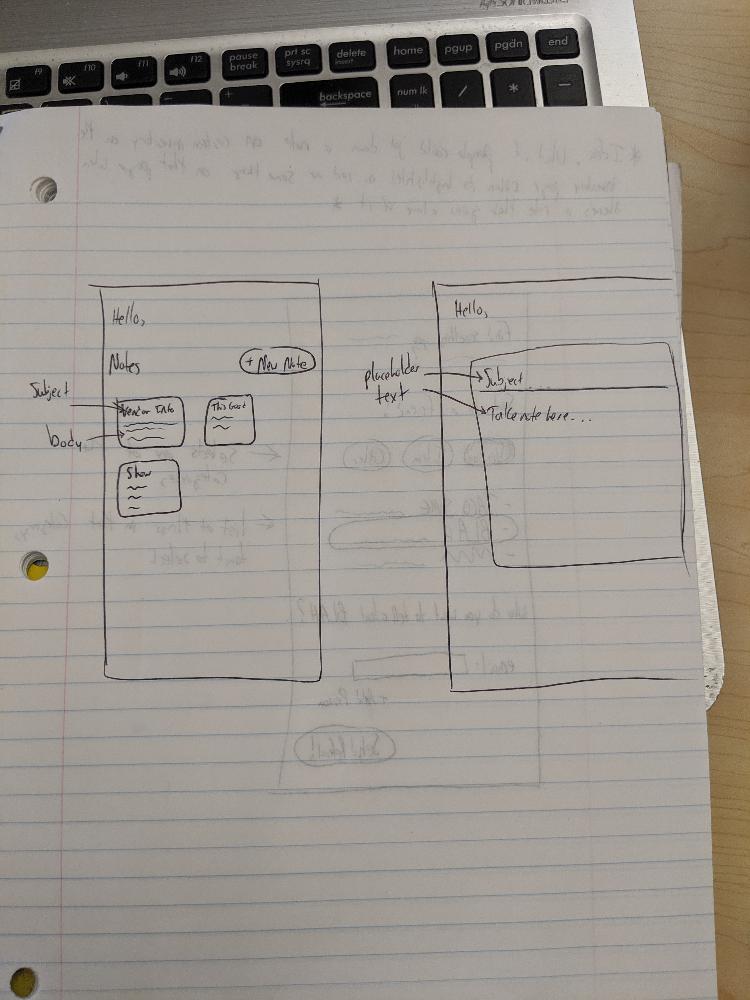
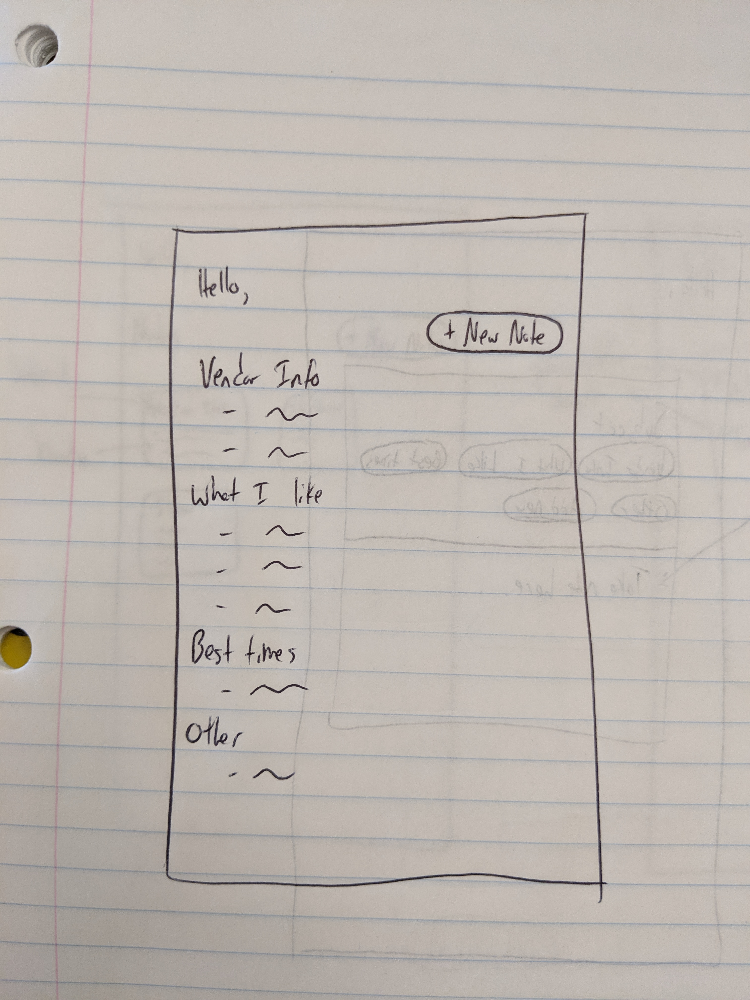
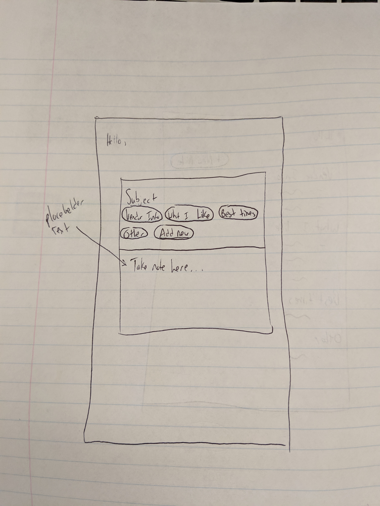
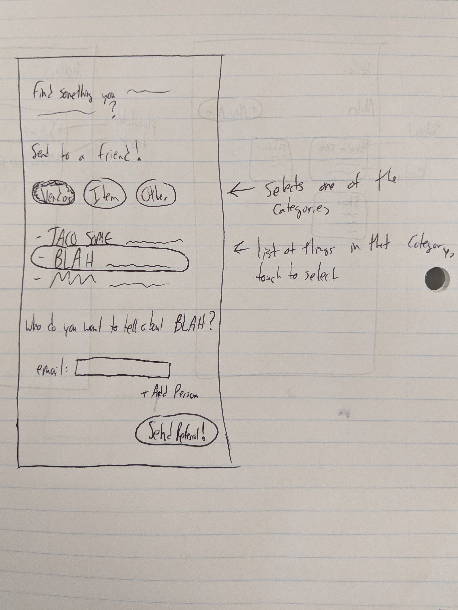

Notes:

Potential Notes Page Design 1:
For the notes page, I considered a two different layouts. The first layouts can be found in the notes.jpg file, where you see two screens, one with all of the notes listed and one where the user is creating a new note.  This layout is familiar to our users as it shows the notes laid out in a "sticky note" format.  In this format, when the user creates a new note, it pops up, takes up the majority of their screen and gives the user the impression that they are writing on a sticky note. I derived inspiration for this design from google's "keep notes" service, which has provided users with a simple and intuitive way to take quick notes on their phones or desktops. 

Potential Notes Page Design 2:
The alternative design shows the notes page being laid out like a list.  On this list, different notes would be organized by the subject that they have and when users make a new note, they can select previously used subjects to become the subject of their new note (or they can make a new one).  The justification for that is that users might find it useful to have their notes automatically organized for them, so that they can find information that should be grouped together quickly.

Referral page:
The idea behind this design was that users may want to tell their friend about something at the market that they really like.  With this design, users can decided what kind of thing they want to refer (vendor, inventory item, etc.) and a list items in that category would pop up.  After they click the category and click specifically the item they are referring, they can just type in a friends email address and refer that to them.